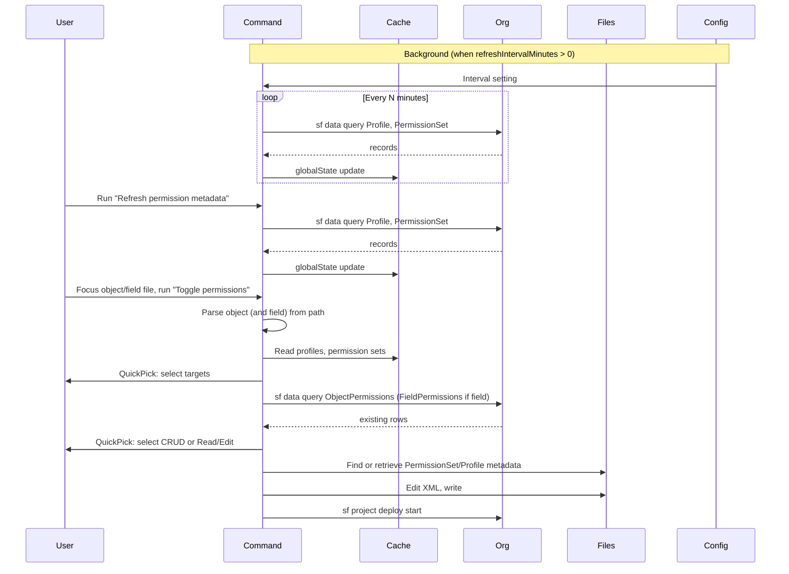

# Permission Toggle and Refresh Metadata Plan

## Context

- **Object permissions** (ObjectPermissions): apply to an object; fields: `allowCreate`, `allowDelete`, `allowEdit`, `allowRead`, `viewAllRecords`, `modifyAllRecords` (and `object` for the object API name). See [PermissionSet metadata](https://developer.salesforce.com/docs/atlas.en-us.api_meta.meta/api_meta/meta_permissionset.htm).
- **Field permissions** (FieldPermissions): apply to a field; fields: `PermissionsRead`, `PermissionsEdit` (and `field` in format `ObjectName.FieldName`, `sobjectType`). ObjectPermissions for that object must exist for the parent (Profile/PermissionSet) before FieldPermissions are valid; if there is no object access yet, no FieldPermissions row exists in the org.
- Extension already uses `sf` CLI and `executeShellCommand` ([src/commands/shared/utilities.ts](src/commands/shared/utilities.ts)); permsets use `sf data query` and `sf org assign permset` ([src/commands/permsets/main.ts](src/commands/permsets/main.ts)).
- **All org data must be fetched via the Salesforce CLI**: use `sf data query --query "SOQL" --json` for every query (Profile, PermissionSet, ObjectPermissions, FieldPermissions). No direct REST/Tooling API calls.
- Object/field context: object = `.object-meta.xml`; field = `.field-meta.xml` under `objects/*/fields/` ([src/commands/objects/main.ts](src/commands/objects/main.ts), [src/commands/fields/main.ts](src/commands/fields/main.ts)).

## 1. Refresh permission metadata command

- **Purpose**: Load from the org and store in extension memory the list of **Profiles** and **Permission Sets** (and optionally minimal data to resolve PermissionSet ↔ Profile for profile-backed permission sets).
- **CLI only**: Use **Salesforce CLI** for all queries: `sf data query --query "SOQL" --json`. No REST or Tooling API. Same for ObjectPermissions/FieldPermissions in the toggle flow.
- **Storage**: Use `context.globalState` (or `workspaceState` if preferred per-workspace) with keys such as `permissionEditor.profiles` and `permissionEditor.permissionSets`. Store array of `{ id, name, label?, isOwnedByProfile? }` (PermissionSet) and `{ id, name }` (Profile). Profile list: `sf data query --query "SELECT Id, Name FROM Profile" --json`. Permission sets: `sf data query --query "SELECT Id, Name, Label, NamespacePrefix, IsOwnedByProfile FROM PermissionSet WHERE IsOwnedByProfile = false" --json` (or include both and label in UI).
- **Implementation**: New command (e.g. `sf-ext-plus.refreshPermissionMetadata`) that runs the two `sf data query` calls, parses JSON output, and writes to `context.globalState`. Show progress/status and a message when done (e.g. "Loaded N profiles and M permission sets").
- **No persistence of ObjectPermissions/FieldPermissions in refresh**: Keep refresh lightweight. When the user runs "Toggle permissions", query **existing** ObjectPermissions/FieldPermissions via `sf data query` only for the **current object (or object of the field)** and the **selected** permission sets/profiles, so we know what already exists and can add or update.

### 1.1 Background refresh (periodic)

- **Behavior**: Run the same refresh logic (Profile + PermissionSet via `sf data query`) **periodically in the background**, so the cached list stays up to date without the user running the command every time.
- **Configurable via extension setting**: Add a contribution in `package.json` under `contributes.configuration` so the user can control:
  - **Interval**: e.g. `sf-ext-plus.permissionMetadata.refreshIntervalMinutes` (number). Suggested default: `15`. Use `0` to mean "disabled" (no background refresh), or add a separate boolean `sf-ext-plus.permissionMetadata.backgroundRefreshEnabled` and only run the timer when `true`. Recommendation: single setting `refreshIntervalMinutes`; `0` = disabled, positive = interval in minutes.
- **Implementation**: On activation, read the setting with `vscode.workspace.getConfiguration('sf-ext-plus').get<number>('permissionMetadata.refreshIntervalMinutes', 15)`. If &gt; 0, call `setInterval` (or `setTimeout` recursive) to invoke the refresh function on that interval (in milliseconds). Run the first refresh after a short delay (e.g. 5–10 seconds) to avoid blocking startup. Use `context.subscriptions.push({ dispose: () => clearInterval(timer) })` so the timer is cleared on deactivation. Register a `vscode.workspace.onDidChangeConfiguration` listener; when the interval setting changes, clear the old timer and start a new one with the new interval (or stop if set to 0).
- **Scope**: Background refresh should run in a valid SFDX workspace with a default org; if `sf data query` fails (e.g. no org), fail silently or log without showing noisy errors, and retry on the next interval.

## 2. Toggle object/field permissions command

- **When shown**: Only when the active editor is an object or field metadata file. Use `package.json` enablement, e.g. `"when": "resourcePath =~ /\\.(object-meta|field-meta)\\.xml$/"` so the command appears in the palette only in that context (and is disabled otherwise).
- **Step 1 – Choose targets**: Show a QuickPick of **Profiles** and **Permission Sets** from the cached lists (from refresh). If cache is empty or stale, show a single option "Refresh permission metadata first" that runs the refresh command and then re-opens the flow (or show an error and ask user to run Refresh first). Allow **multi-select** (one or more profiles and/or permission sets).
- **Step 2 – Choose permissions**:
  - **Object file** (`.object-meta.xml`): Parse the file (or path) to get the object API name (e.g. `Account`, `MyObject__c`). Show a multi-select or checkbox list for **ObjectPermissions**: `allowCreate`, `allowDelete`, `allowEdit`, `allowRead`, `viewAllRecords`, `modifyAllRecords`. Pre-select or show current state if we already fetched existing ObjectPermissions for the selected targets (see below).
  - **Field file** (`.field-meta.xml`): Derive object API name and field API name from path (e.g. `objects/MyObject__c/fields/MyField__c.field-meta.xml` → object `MyObject__c`, field `MyObject__c.MyField__c`). Show **FieldPermissions**: **Read** (`PermissionsRead`), **Edit** (`PermissionsEdit`). If any selected target has **no** ObjectPermissions for that object yet, the UI or apply step must ensure we **add object-level access first** (e.g. at least `allowRead`) so that FieldPermissions are valid; document this in code and optionally show a short note in the QuickPick.
- **Existing state**: Before showing the permission toggles, for each selected Profile/PermissionSet, query existing ObjectPermissions (and, for field, FieldPermissions) for this object (and field). Use **Salesforce CLI** only: `sf data query --query "SOQL" --json` with SOQL:
  - ObjectPermissions: `SELECT ParentId, SobjectType, PermissionsCreate, PermissionsRead, PermissionsEdit, PermissionsDelete, PermissionsViewAllRecords, PermissionsModifyAllRecords FROM ObjectPermissions WHERE ParentId IN (selected Ids) AND SobjectType = '...'`
  - FieldPermissions: `SELECT ParentId, Field, SobjectType, PermissionsRead, PermissionsEdit FROM FieldPermissions WHERE ParentId IN (selected Ids) AND SobjectType = '...' AND Field = '...'`
  Map SOQL field names to metadata names (e.g. `PermissionsCreate` → `allowCreate`) and use this to pre-select current values in the QuickPick.
- **Apply changes**: For each selected target (Profile or PermissionSet):
  - **Resolve metadata file**: Determine the local path for the permission set or profile (e.g. `**/permissionSets/<Name>.permissionSet-meta.xml`, `**/profiles/<Name>.profile-meta.xml`). If not found in the workspace, **retrieve** that metadata from the org (`sf project retrieve start --metadata PermissionSet:<Name>` or `Profile:<Name>`), then edit the newly retrieved file.
  - **Read → modify → write**: Parse the XML (reuse or mirror patterns from existing code; consider `fast-xml-parser` / `xml2js` already in the project). For **object**: ensure one `<objectPermissions>` entry for the object; set the six boolean elements according to the user’s choices. For **field**: ensure the parent has object access for that object (add `<objectPermissions>` with at least `allowRead` if missing); add or update `<fieldPermissions>` for the field with `readable`/`editable` (or the exact element names used in the metadata XML). Write the file back.
  - **Deploy**: Run `sf project deploy start` for the modified file(s) (or the metadata type and name) so the org is updated.
- **Edge cases**: (1) Profile/permission set not in project → retrieve first, then edit and deploy. (2) Object has no object permission yet → when adding field permission, add object permission first. (3) Metadata API version 40.0+ overwrites other FieldPermissions if the full set isn’t sent; editing the **local file** and deploying the whole PermissionSet/Profile avoids that because we’re sending the full file.

## 3. File and registration layout

- **New module**: e.g. `src/commands/permissioneditor/` (or under `permsets/` if you prefer a single permission area).
  - `main.ts`: Register both commands (`refreshPermissionMetadata`, `toggleObjectFieldPermissions`), read/write globalState, and call into helpers.
  - **Refresh**: one function that runs the two SOQL queries and updates `context.globalState`.
  - **Toggle**: orchestration (get active editor path → object/field → load cache → QuickPick targets → query existing Object/Field permissions → QuickPick permissions → resolve files → edit → deploy). Helpers for: parsing object/field from path, building SOQL for ObjectPermissions/FieldPermissions, finding or retrieving PermissionSet/Profile metadata file, applying object/field permission changes to XML, and running deploy.
- **package.json**: Add:
  - **Commands**: `sf-ext-plus.refreshPermissionMetadata` ("Salesforce Ext.+: Refresh permission metadata (profiles & permission sets)"), `sf-ext-plus.toggleObjectFieldPermissions` ("Salesforce Ext.+: Toggle object/field permissions") with `"when": "resourcePath =~ /\\.(object-meta|field-meta)\\.xml$/"`.
  - **Configuration**: Under `contributes.configuration`, add a section `sf-ext-plus.permissionMetadata` with property `refreshIntervalMinutes` (type `number`, default e.g. `15`, description: interval in minutes for background refresh of permission metadata; use `0` to disable background refresh).
- **extension.ts**: Call the new activator (e.g. `activatePermissionEditor(context)`) so both commands are registered and the background timer (and config listener) are set up.

## 4. Types and shared bits

- **Shared types**: Define small interfaces for cached Profile, PermissionSet, and for ObjectPermissions/FieldPermissions as returned by SOQL and as used in metadata XML (and mapping between them). Put in `src/commands/shared/types.ts` or in the new module.
- **CLI**: All org queries use the **Salesforce CLI query statement**: `sf data query --query "SOQL" --json`. Reuse `executeShellCommand`; ensure `sf` is run in a workspace folder that has an SFDX project (reuse `checkIfWorkspaceIsValidSfdxProject` where appropriate). Handle `sf data query` JSON (status, result.records) and `sf project deploy start` output.

## 5. Testing

- Add or extend tests for: (1) parsing object/field from editor path (object vs field, API names); (2) mapping SOQL ObjectPermissions/FieldPermissions to metadata flags; (3) logic that ensures object permission exists before adding a field permission. Keep tests in `src/test/` and ensure they remain passing and coverage stays above 80% for touched code.

## Summary flow (mermaid)

## Open decisions

- **Scope of refresh**: Only custom permission sets (`IsOwnedByProfile = false`) or also profile-backed permission sets (to show "Profile X" as a single entry backed by one PermissionSet per profile). Recommendation: include both; for Profiles use `Profile` SOQL; for "Permission Sets" use `PermissionSet WHERE IsOwnedByProfile = false`. So two lists: Profiles (for editing profile metadata) and Permission Sets (for editing permission set metadata).
- **Deploy**: Deploy only the changed metadata files (e.g. `--source-dir` for the specific file or `--metadata PermissionSet:Name`) to keep deploys fast and safe.

